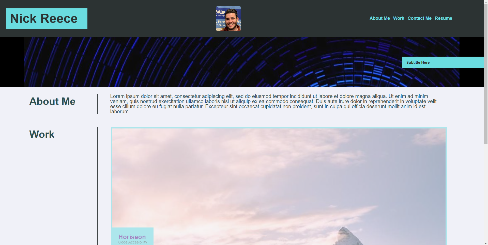

# module-2
Professional Portfolio

## Description

Welcome to my first professional portfolio created without starter code. 

This project was created as a way of combining the HTML and CSS knowledge I have gained over my first two weeks of learning to become a web developer. This build is to give me a template to build upon for more reactive and funcional projects in the future, as well as to test my knowledge gaines. I built responsive functionality into the site with CSS and learned about FlexBox.

This project serves as my first full landing page I have ever built solo. I look forward to continuing to build upon the skills and knowledge gained here.

## Installation

N/A

## Usage

To view the page, navigate to the below we address. You should be greeted with a webpage resembling the below screenshot.

https://nreece6.github.io/first-professional-portfolio/

## Credits

Credit to https://picsum.photos/ for the photos used in the "Work" section of the page.

## License

The last section of a high-quality README file is the license. This lets other developers know what they can and cannot do with your project. If you need help choosing a license, refer to [https://choosealicense.com/](https://choosealicense.com/).

---

